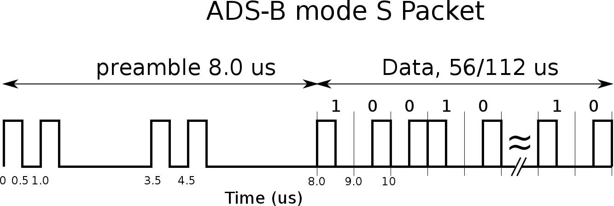
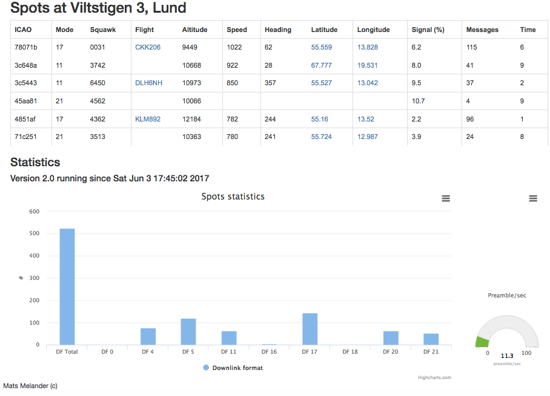

# spots - dump1090 in Python

An implementation to detect and decode Mode-S messages modulated on 1090MHz.
The implementation is implemented fully in Python (2.7.9), tested on raspberry pi 2 model B hardware using an 
RTL-SDR USB dongle.

Try [http://www.viltstigen.se/spots/spots](http://www.viltstigen.se/spots/spots) for live demo. 
No guarantee however that it is up and running.

Focus is on using Python idioms and readability, not optimizations.
Other implementations in C are likely more efficient.

The implementation is multi-threaded:
* Tuner: sample the signal
* Squitter: decoded messages
* Radar: main application that displays messages
* Basic: fundamentals

It tries to be as complete and accurate as possible but with no guarantees of being correct.

The following message will be decoded:

* Short air-to-air surveillance (Downlink format: 0)
* Surveillance altitude reply (Downlink format: 4)
* Surveillande identity reply (Downlink format: 5)
* Long air-to-air surveillance (Downlink format: 16)
* ADS-B, Extended Squitter (Downlink format:17)
* Comm BDS altitude reply (Downlink format: 20)
* Comm BDS identity reply (Downlink format: 21)

Messages decoded are displayed either in a serialised format on standard output
or in a tabular format depending on preference. An inbuilt server is listening on port 5051 (configurable) and
enables a client to access decoded messages in json format.

Some statistics is collected, this data is also accessible through the server

## Dependencies

Spots uses [pyrtlsdr](https://github.com/roger-/pyrtlsdr) v0.2.0 to read samples. 
Use the installation description to install.

pyrtlsdr is wrapper for rtlsdr library, so this needs to be installed.

See the following references:

* http://sdr.osmocom.org/trac/wiki/rtl-sdr
* http://zr6aic.blogspot.se/2013/02/setting-up-my-raspberry-pi-as-sdr-server.html

The following worked for me

    $ sudo apt-get update
    $ sudo apt-get install cmake
    $ sudo apt-get install libusb-1.0-0.dev
    $ git clone git://git.osmocom.org/rtl-sdr.git
    $ cd rtl-sdr/
    $ mkdir build
    $ cd build
    $ cmake ../
    $ make
    $ sudo make install
    $ sudo ldconfig

Edit the blacklist
 
    $ sudo nano /etc/modprobe.d/raspi-blacklist.conf

Add these lines

    blacklist dvb_usb_rtl28xxu
    blacklist rtl2832
    blacklist rtl2830

Finally

    $ sudo cp ../rtl-sdr.rules /etc/udev/rules.d/
    $ pip install pyrtlsdr
    $ sudo shutdown -r 0

## References

As the implementation have no access to specifications the following implementations serves
as references for spots

* [dump1090 by antirez](https://github.com/antirez/dump1090), the original
* [dump1090 by Malcolm Robb](https://github.com/MalcolmRobb/dump1090), a fork of antirez
* [dump1090 by flighaware](https://github.com/flightaware/dump1090), another fork
* [java adsb at OpenSky](https://github.com/openskynetwork/java-adsb), a java implementation
* [ADS-B decoding guide](http://adsb-decode-guide.readthedocs.io/en/latest/index.html)
* [Software Defined Radio, lab at Berkley](http://inst.eecs.berkeley.edu/~ee123/sp15/lab/lab2/lab2-TimeDomain-SDR.html)

## Usage

Simply try

    $ python radar.py

## Configuration options

Configuration for spots is in `spots_config.json`. Follows json syntax with no error checks so be careful.

* verbose logging (true/false): writes messages to spots logfile
* check crc (true/false): whether to check crc (recommended) or not
* check phase (true/false): simple check if there is a phase shift and correction
* use metric (true/false): show values in metric system or not (altitude and velocity)
* apply bit error correction (true/false): whether to try to correct bit errors or not (CPU demanding if true)
* run as daemon (true/false): if true and read from file is true, do not terminate the program when file read is done 
* read from file (true/false): if true, read samples from a file rather than from the USB dongle
* file name (string): if "read from file" is true, this is the file to read from
* use text display (true/false): if true, show data in table format, if false show in serialised way
* max blip ttl (integer or float): how many seconds to keep an identified aircraft in the table display
* user latitude (float): your latitude position
* user longitude (float): and your longitude
* log file (string): The name of the log file
* log max bytes (integer): How many bytes to log before the log file is rotated
* log backup count (integer): How many roted log files to keep
* spots server address (localhost or ip-address): the address for the server
* spots server port (5051): the server port
* flight db name (string): name of database file to store flight counts, if the value is "" this function is skipped

## Client/Server

Use nginx as proxy server with the following added to the nginx conf file

    location /spots {
    try_files $uri $uri/ $uri/index.html $uri.html @spots;
    }

    location @spots {
        proxy_pass http://rpi3.local:8080;
        proxy_redirect     off;
        proxy_set_header   Host $host;
        proxy_set_header   X-Real-IP $remote_addr;
        proxy_set_header   X-Forwarded-For $proxy_add_x_forwarded_for;
        proxy_set_header   X-Forwarded-Host $server_name;
    }

So, nginx will forward any http requests to spots (e.g. `http://www.viltstigen.se/spots`) to 
`http://rpi3.local:8080` (spots runs on rpi3-node). Restart nginx to capture updates through

    $ sudo /etc/init.d/nginx restart
    $ /etc/init.d/nginx status

Flask is running using Gunicorn, listening on port 8080, see `emitter.py` and `spots_emitter.conf` for details.
Use `supervisor` to control processes running as daemons.

    $ sudo ln -s /home/pi/app/spots/spots_emitter.conf /etc/supervisor/conf.d/spots_emitter.conf
    $ sudo ln -s /home/pi/app/spots/radar.conf /etc/supervisor/conf.d/radar.conf
    $ sudo supervisorctl reread
    $ sudo supervisorctl update
    $ sudo supervisorctl status
    
The flask application communicates with the radar application (that listen on port 5051) through a simple text
protocol, see files `emitter.py` and `server.py`

Using some html, bootstrap css and javascripts (jQuery and Highcharts), see files spots.html and spots.js, it is
possible to get this view in a web browser.

## What's next?

There are probably inconsistencies, bugs, optimizations, documentation etc etc to make.
If you find something, let me know but be aware that this is a leisure thing for me.
